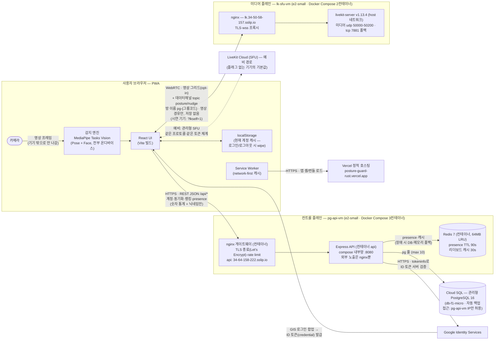
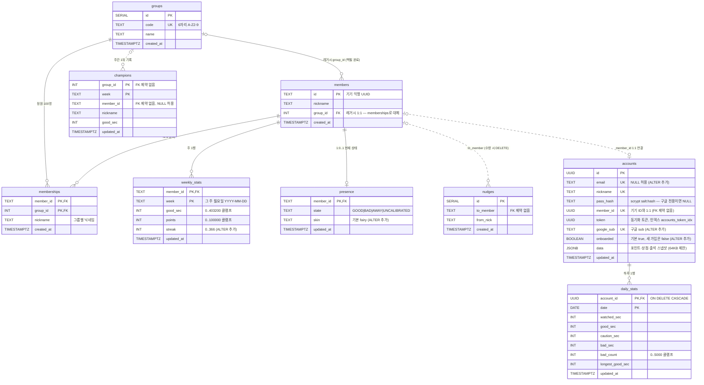
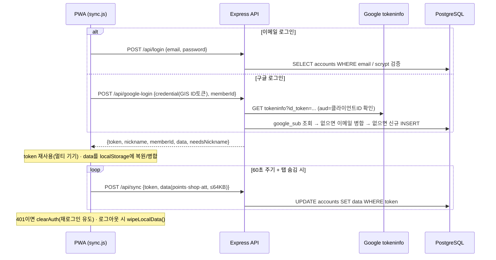
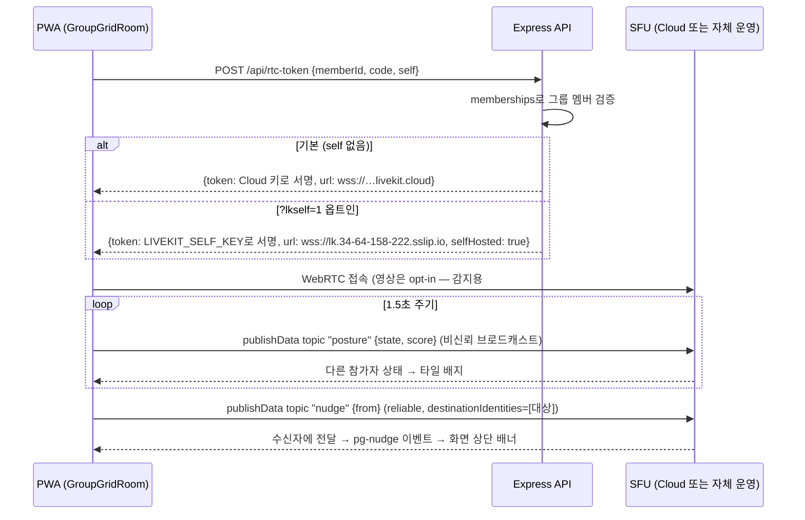

# 시스템 아키텍처 — 척추요정 (Posture Guard)

> 진실은 코드다. 이 문서는 `backend-vm/server.js` · `backend-vm/signaling.js` · `frontend/src/sync.js` · `frontend/src/app.js` · `frontend/src/components/GroupGridRoom.jsx` 를 그대로 읽어 정리한 것이다 (2026-07 기준).
>
> **한 줄 요약**: 자세 감지(카메라·AI)는 전부 내 기기 안에서 돌고, 서버에는 **숫자 통계와 닉네임만** 올라간다. 카메라 영상은 우리 서버(GCP VM)로 **절대 가지 않는다**.

---

## 1. 시스템 아키텍처 다이어그램



고1 눈높이 설명: 앱 파일(HTML/JS)은 Vercel에서 받아오고, 그다음부터 자세 감지는 전부 내 브라우저 안에서 돈다. 서버(GCP VM)에는 "이번 주 바른 자세 몇 초, 포인트 몇 점" 같은 **숫자**만 보낸다. 반 전체 그리드에서 카메라를 공유하면 그 영상은 중계 서버(SFU)를 **지나가기만** 하고(저장 없음) 데이터베이스에는 아예 오지 않는다.

**대표 아키텍처 = 자체 SFU(셀프호스팅)**: 같은 오픈소스 LiveKit 서버를 우리 VM에 직접 설치·운영한다(기술 서사 — P2P mesh 자작 → SFU 전환 → SFU 직접 운영의 3단계). **발표·시연 기기는 `?lkself=1`로 접속해 이 경로를 탄다** — "셀프호스팅으로 구현했다"는 발표 설명과 실물이 일치. LiveKit Cloud는 **예비 경로**(플래그 없는 일반 기기의 기본값)로 병행해, 트래픽·비용이 커지거나 VM에 문제가 생겨도 서비스가 끊기지 않는 안전판 역할. 상세: [라이브킷-셀프호스팅.md](라이브킷-셀프호스팅.md).

개발자 노트:

- **CORS 화이트리스트** (server.js): 프로덕션 alias + Vercel 팀 스코프 프리뷰 URL 패턴 + `localhost:*` 를 정규식으로 허용. Origin 없는 요청(curl/서버 간)은 통과.
- **rate limit**: `/api/*` 분당 120회 — 키는 `memberId → token → IP` 순서 (학교 NAT에서 반 전체가 IP 하나를 공유해도 개인별로 카운트). 그룹 생성은 별도로 시간당 10회.
- **api는 compose 내부망에만** — 외부 노출은 nginx(HTTPS)뿐. `trust proxy 1`로 실제 IP 복원. nginx `limit_req`가 로그인·가입·구글로그인에 IP당 분당 10회 게이트웨이 방어선을 추가.
- **Redis 역할 (딱 2곳, 오버엔지니어링 배제)**: ① `presence:<memberId>` TTL 90초 — 하트비트가 끊기면 만료 = 자동 오프라인 ② `board:<code>:<week>` 30초 리더보드 캐시. 미설정·장애 시 기존 DB·인메모리 경로로 자동 폴백(코드 한 벌로 양쪽 동작). 참고 논문(JIIBC 2024)의 "Redis 통계 캐시" 제안을 실제로 구현한 지점.
- **레거시 시그널링** (`signaling.js`): LiveKit 도입 전의 P2P mesh용 WebSocket `/ws` (SDP/ICE 중개만, 영상 저장 없음, 멤버십 DB 검증). `server.js`가 아직 `attachSignaling()`으로 붙여 두었지만 그리드는 LiveKit으로 대체됨 — 정리 후보.

---

## 2. ERD

`server.js` 기동 시 스키마 보장 블록(`CREATE TABLE IF NOT EXISTS` + `ALTER TABLE ADD COLUMN IF NOT EXISTS`)의 실제 결과. 점선 = 코드/데이터로만 이어진 논리적 관계 (DB에 FK 제약 없음).

> LiveKit 셀프호스팅 도입(2026-07-22)은 **인프라 계층 변화라 스키마 변경이 없다** — 자체 SFU의 키는 DB가 아니라 systemd 환경 변수(`LIVEKIT_SELF_*`)로 관리되고, 토큰 발급 분기는 `/api/rtc-token` 코드에서 끝난다. 아래 ERD는 그대로 유효하다.



테이블 한 줄 설명:

| 테이블 | 설명 |
|---|---|
| `groups` | 그룹(반/스터디). 6자리 참여 코드가 유니크 키. |
| `members` | 기기 단위 익명 멤버 (id = 클라이언트가 만든 UUID). `group_id`는 레거시 — 지금은 `memberships`가 진실이며 기동 시 멱등 백필된다. |
| `memberships` | 기기↔그룹 N:N. 그룹마다 다른 닉네임 허용. PK(member_id, group_id). |
| `weekly_stats` | 주간 리더보드 원본 — 주(월요일 날짜)당 1행 upsert 덮어쓰기(반복 업로드로 안 불어남). |
| `presence` | 기기당 1행의 "지금 자세 상태 + 착용 스킨" — 엔진이 30초마다 upsert. |
| `nudges` | REST 경로의 "콕 찌르기" 우편함 — 수신자가 폴링으로 가져가면 `DELETE ... RETURNING`으로 즉시 비운다. |
| `champions` | 그룹×주 명예의 전당 — 리더보드 조회(캐시 미스) 때 그 주 1위를 멱등 upsert. |
| `accounts` | 로그인 계정 — 이메일+scrypt 또는 구글(sub). `token`이 동기화 인증 키(멀티 기기 재사용), `data` JSONB에 포인트·상점·출석 백업. |
| `daily_stats` | 계정별 일별 공부/자세 집계(캘린더) — 기기별 스냅샷을 필드별 `GREATEST`로 병합(overwrite 플래그로 초기화 가능). |

---

## 3. 주요 데이터 흐름

### 3-1. 로그인 → 동기화 (sync.js)



핵심 원칙: **서버가 원본, 로컬은 현재 계정의 캐시.** 부팅 시 `sync-pull` 후 max/합집합 병합, 로그아웃하면 기기(특히 공용 기기)에서 개인 데이터를 지운다.

### 3-2. 일별 통계 (캘린더)

- 엔진이 1분 주기·측정 종료 시 오늘 스냅샷을 로컬 `pg_daily`에 필드별 max로 기록.
- 로그인 상태면 최근 14일을 `POST /api/daily`로 업로드 — 서버도 필드별 `GREATEST` 병합이라 여러 기기·중복 전송에 안전(늦게 도착한 옛 스냅샷이 기록을 깎지 못함). 초기화 버튼만 `overwrite: true`로 병합 우회.
- 캘린더 월 이동 시 `POST /api/daily-pull {from, to}` (최대 366일 범위)로 내려받아 로컬에 다시 max 병합.

### 3-3. 그룹 랭킹 + presence (app.js, REST 폴링)

- 업로드: 그룹 소속 + 탭 표시 중일 때 `POST /api/stats {memberId, week, goodSec, points, streak}` — 주당 1행 upsert, 서버가 상한 클램프. 엔진은 30초마다 `POST /api/presence {state, skin}`.
- 조회: `GET /api/leaderboard?code&week` — memberships⋈weekly_stats⋈presence 조인, good_sec 내림차순 100명. 인메모리 30초 캐시(그룹당 읽기 비용 절감). 캐시 미스 때만 그 주 1위를 `champions`에 upsert(쓰기 자연 스로틀) + 지난 5주 챔피언 반환.
- 콕(REST 경로): `POST /api/nudge` — 같은 그룹인지 DB로 검증, 같은 상대 분당 1회. 수신자는 `GET /api/nudges` 폴링(30초)으로 수령 즉시 삭제.

### 3-4. 실시간 그리드 + 콕 (GroupGridRoom.jsx, LiveKit)



- 영상·점수 모두 **SFU 경유, 저장 없음** — 기본(Cloud) 경로에서 GCP VM은 JWT 발급만 하고, 셀프호스트 경로에서는 VM의 `livekit-server`가 SFU 중계까지 맡는다(그래도 DB엔 영상이 닿지 않는다).
- 카메라 공유는 기본 OFF(opt-in), 공유해도 감지용 트랙을 재사용해 모바일 이중 카메라를 방지.
- 콕 클라이언트 쿨다운 12초(+REST 경로는 서버가 분당 1회 강제).

---

## 4. 운영 메모

### 배포 (백엔드 — Docker Compose)

전 백엔드가 컨테이너 5종(nginx·api·db·redis·livekit)으로 뜬다. 스택 정의 `infra/docker-compose.yml`, 마이그레이션·인증서 런북 `infra/README.md`. VM 경로는 `~/stack/`.

```bash
# 1) 코드 업로드 (server.js가 바뀌었을 때. signaling.js도 바뀌었으면 같이)
#    맥 gcloud가 파이썬 문제로 깨지면 CLOUDSDK_PYTHON=/opt/homebrew/bin/python3 을 앞에 붙인다.
gcloud compute scp backend-vm/server.js pg-api-vm:~/stack/backend-vm/server.js --zone asia-northeast3-a

# 2) 재빌드 + 재기동 (npm 레이어는 캐시 — 수 초)
gcloud compute ssh pg-api-vm --zone asia-northeast3-a \
  --command 'cd ~/stack/infra && sudo docker compose build api && sudo docker compose --profile vm up -d'
```

- 스키마 변경은 마이그레이션 도구 없이 `server.js` 상단의 멱등 스키마 보장 블록에 추가 → 재기동 시 자동 적용.
- 프론트는 Vercel — `git push`(또는 `vercel --prod`)로 배포, 프리뷰 URL은 CORS 정규식이 이미 허용.
- 환경 변수: VM의 `~/stack/infra/.env` (git 제외, VM에만 존재) — `DATABASE_URL`(Cloud SQL 전체 접속 URL), `LIVEKIT_URL/API_KEY/API_SECRET`(미설정 시 rtc-token 503), `LIVEKIT_SELF_*`(셀프호스트 서명 키 + 미디어 VM 주소), `GOOGLE_CLIENT_ID`(미설정 시 google-login 503).
- 인증서: certbot 컨테이너로 발급·갱신(월 1회 `renew` — infra/README.md), nginx가 서빙.
- 데이터: **Cloud SQL `pg-cloudsql`(관리형 PostgreSQL 16, db-f1-micro·HDD 10GB)** — 접근은 authorized networks로 pg-api-vm 외부 IP만 허용. 수동 덤프: `docker run --rm postgres:16-alpine pg_dump "<DATABASE_URL>" > 파일`. 롤백용 구 데이터는 VM의 `posture-guard_pgdata` 볼륨에 보존.

### 셀프호스트 SFU (livekit-server) 운영 요약 — 전용 미디어 VM

- **미디어 플레인 분리(2026-07-23)**: SFU는 전용 VM `lk-sfu-vm`(e2-small, 외부 IP 34.50.58.157)에서 운영 — 스택 정의 `infra-lk/`(nginx + livekit 2컨테이너). 영상 스트리밍 부하가 API·DB(컨트롤 플레인)에 영향을 못 주는 구조.
- livekit 컨테이너: 공식 이미지 v1.13.4, host 네트워크(UDP 대역 성능), 키는 VM의 `~/infra-lk/.env`(VM 생성 때 신규 발급 — 구 키 자동 로테이트). 방화벽 `lk-sfu-web`(80/443)·`lk-sfu-rtc`(tcp:7881, udp:50000-50200), 태그 `lk-sfu`.
- 주소: `wss://lk.34-50-58-157.sslip.io` — pg-api-vm `.env`의 `LIVEKIT_SELF_URL`이 가리키고, rtc-token(`self:true`)이 이 URL로 서명·반환(e2e JoinResponse 검증 완료).
- 전환: 클라이언트 `?lkself=1`(켬)/`?lkself=0`(끔) — 플래그 없는 기기 기본값은 Cloud(예비). SFU만 끄기: lk-sfu-vm에서 `sudo docker compose stop livekit`.
- **비용 주의**: 셀프호스트 영상은 GCP 이그레스 과금(N명 방 = N×(N-1)×비트레이트) — 실험은 짧게, 반 전체 시연은 Cloud로. 상세 절차·검증 기록: [라이브킷-셀프호스팅.md](라이브킷-셀프호스팅.md).

### VM 수명 — 2주 한정 (중요)

학습용으로 **2주만 운영**하고 삭제한다. DB는 Cloud SQL로 분리돼 **VM을 지워도 데이터는 안전**하지만, Cloud SQL 인스턴스도 과금되므로 종료 시 함께 정리한다(정리 전 최종 pg_dump 1회 권장).

```bash
gcloud compute ssh pg-api-vm --zone asia-northeast3-a
sudo -u postgres pg_dump <DB이름> > pg_backup_$(date +%F).sql   # VM 안에서
# 로컬로 내려받기: gcloud compute scp pg-api-vm:~/pg_backup_*.sql . --zone asia-northeast3-a
# 그 다음에만 (VM 2대 + Cloud SQL):
#   gcloud compute instances delete pg-api-vm --zone asia-northeast3-a
#   gcloud compute instances delete lk-sfu-vm --zone asia-northeast3-a
#   gcloud sql instances delete pg-cloudsql
```

### rate limit 정책 (server.js에 구현된 그대로)

| 대상 | 한도 | 키 |
|---|---|---|
| `/api/*` 전체 | 분당 120회 | `memberId → token → IP` 순 (학교 NAT에서 반 전체가 IP 하나여도 개인별 카운트) |
| `POST /api/group` | 시간당 10회 | 위와 동일 체계의 별도 리미터 |
| `POST /api/nudge` | 같은 상대에게 분당 1회 | DB 조회로 강제 (nudges 최근 60초) |
| 로그인·가입·구글로그인 | IP당 분당 10회 (nginx `limit_req`) | 게이트웨이 계층 — Express 리밋과 이중 방어 |
| 리더보드 조회 | 30초 Redis 캐시 (`board:code:week`) | Redis 장애 시 인메모리 캐시 폴백 |
| 값 상한 클램프 | good_sec ≤ 403,200 · points ≤ 100,000 · streak ≤ 366 · 일별 초 ≤ 86,400 · sync data ≤ 64KB | 서버에서 강제 (클라이언트 치팅 1차 방어) |
